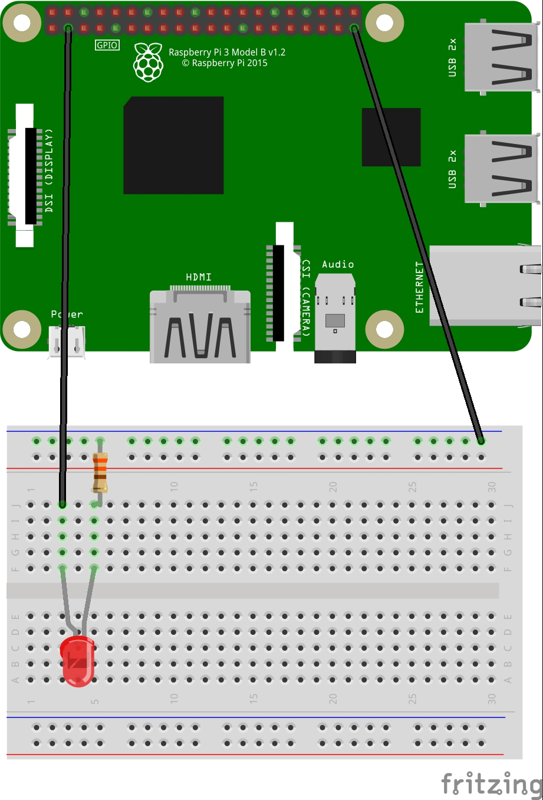
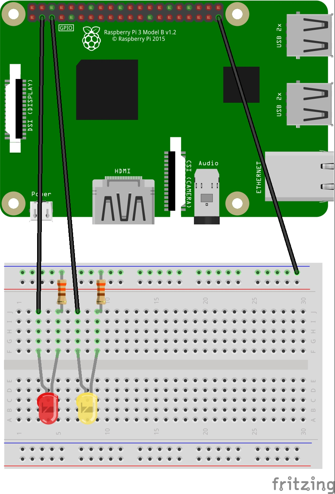
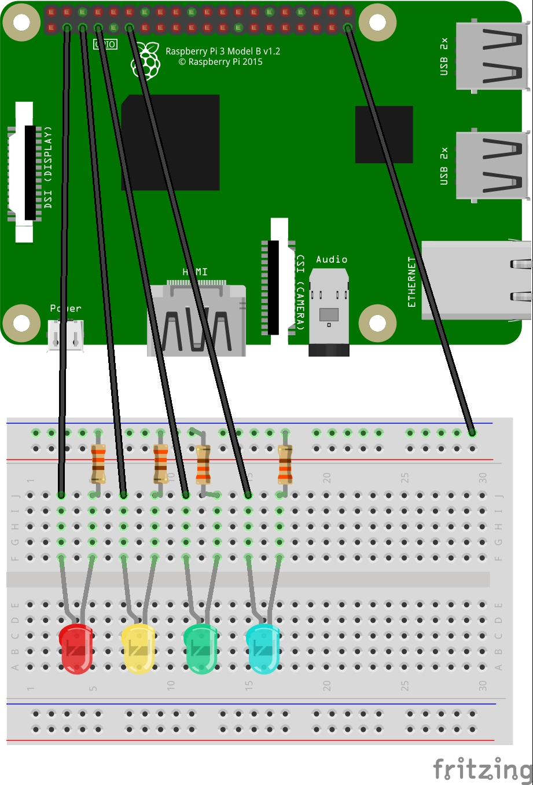

# LED-Chaser-in-Python

Program in Python a series of LED on a breadboard to flash in a sequence. This idea stemmed from the finding that children 
didn't understand traffic lights. The flashing sequence meant nothing to them. So this extends the number of lights to 
flash and adds a different effect. Think KITT car from Nightrider. But that reference is also lost on most people too!

# LED Light Chaser with Python

In this exercise you will build a circuit of lights using LED, connect them to the Raspberry Pi computer and control the 
sequence that the lights illuminate. 

The python code will introduce physical computing with LED and building circuits. Loops and functions will be used in the code.

## Start to Build

The diagram shows the layout of the first LED. The pins on the Raspberry Pi are in the same orientation as the PiTop. 
Use the pin numbers on the identification or count in from the end. The first LED is connected to ground and Pin 2.



The LED must be placed in the correct way round with the shorter leg (cathode) in the same column as the resistor. 
If the LED doesn’t light up later on it could be that the LED is just in the incorrect way round.


## First Piece of Code

Open up the Thonny IDE from the main menu, programming.

The bottom window is the shell where the code will be run and if there are any errors or messages to print, this is where they 
will appear. The top window is the Editor where the code is written and saved before it can be run in the Shell.

In the editor type in these lines of code:
```
from gpiozero import LED
from time import sleep
```
The first lines bring in to your program the code to link the General Purpose Input Output pins information (GPIO) to 
run an LED. The second line will enable you to control pauses in the code. The pins are numbered and are referred to in the next line.
```
first_led = LED(2)
```
The next line connects in the program Pin 2 with a variable named first_led. You could also call it red_led, red, red_light 
or something else useful. Any name will work but make it a name that means something.
```
first_led.on()
sleep(1)
first_led.off()
```
These next three lines complete this piece of code. Quite simply they turn on the LED, wait for one second then turn it off.

Save your code in the Documents folder with a suitable name. Then press the arrow to run your code. The LED should light up.

### It Didn’t Work?
Make sure you used CAPITAL letters where needed only. And brackets (). Is the LED in the correct way round as mentioned before?

## Add Another LED
Now add another LED to the board as in the diagram. It doesn’t have to be in exactly the same place on the board as the 
diagram but the wiring must attached to the Pi correctly. 



The code can now be changed so that it reads as follows. **Do not add all this to your previous code add just what you need to 
make it the same!**
```
from gpiozero import LED
from time import sleep

first_led = LED(2)
second_led = LED(3)

first_led.on()
second_led.off()
sleep(1)
first_led.off()
second_led.on()
```
Save the code and run as before. Hopefully both LED will now light up, one after the other.

### It Didn’t Work?
The code should look like the code above. Read the error message the clues are often helpful. Check your spelling. 
That is all the code needed. CAPITAL letters are important. Don’t forget the brackets (). 


**Now alter the code so that it reads as follows.** This will make the code run again and again until it is turned off.
```
from gpiozero import LED
from time import sleep

first_led = LED(2)
second_led = LED(3)

while True:
first_led.on()
second_led.off()
sleep(1)
first_led.off()
second_led.on()
sleep(1)
```
Save again and rerun. 

### It Didn’t Work?
The true must be True and have the colon at the end. The indented text after the colon is also important. 
The indent is one TAB press.

Can you make the flashing faster or slower than every second? To stop the code either use Ctrl + C in the Shell 
window or restart the code.


## More LED, More Flashy
Now just add even more LED to the breadboard. With more lights comes more code but also more ways to make then flash.

The new LED are connected to pin numbers 4 and 17. You can in fact keep on adding more LED but for the moment four might be enough!



## Additional Code
To the code you already have, add two more lines setting the LED up under the two lines already there.
```
third_led = LED(4)
fourth_led = LED(17)
```
Above the “while True:” line add the following:
```
delay_time = 1
```
This is a new variable just like the led names above. If you look at the code below to should be able to see where it 
drops into the code. Any place that delay_time is used it will be replaced with the value it is equal to.

Now add more code to the loop so that all the LED switch in turn. The loop should look like this. Do not add all this to 
the bottom of what you have at the moment. Alter what you have so that it looks like this.
```
while True:
    first_led.on()
    second_led.off()
    third_led.off()
    fourth_led.off()
    sleep(delay_timer)

    first_led.off()
    second_led.on()
    third_led.off()
    fourth_led.off()
    sleep(delay_timer)

    first_led.off()
    second_led.off()
    third_led.on()
    fourth_led.off()
    sleep(delay_timer)

    first_led.off()
    second_led.off()
    third_led.off()
    fourth_led.on()
    sleep(delay_timer)
```
Save your code and run it again. How is it looking now?

### It Didn’t Work?
Check that you didn’t add the code above underneath the code you already had. That is not what the instructions said to do. 

Change the value of the delay_timer and rerun the code. See how much easier it is than the last time.

That is about all with the basic code. The next page takes the programming a stage further.

## Splitting the Code into Functions

So far when the code lights up a single LED it requires five lines of code. It would be much nicer if it was possible 
to write one line of code to command the sequence. To do this Python uses functions.

A function is written like this:
```
def function_name():
    Code that does something
```
The def is short for define. You are telling the code what it is you are setting up. The name used, like the 
variables, should be relevant to what you are doing. The brackets have to be there even if there is or is not 
anything in them. And it ends with a colon just like the “while True:” line. The next line has to be indented in as well. 
Any lines of code indented after the def belong to the function.

From the code you have Save As the code as a new file with a new name. Then reopen the original again. 
This will enable you to utilise that code without needing to type it all again. Use Cut and Paste.

Change the code to look like this code. Remember Cut & Paste the code you already have, it is quicker than 
typing it all over again.
```
from gpiozero import LED
from time import sleep

first_led = LED(2)
second_led = LED(3)
third_led = LED(4)
fourth_led = LED(17)

delay_timer = 1

def first(timer):
    first_led.on()
    second_led.off()
    third_led.off()
    fourth_led.off()
    sleep(timer)
```

So the first new piece of code is a function simply called first. Under the first line are the exact lines as 
used before except that the delay_timer is now just timer. This code does nothing until it is called into action 
later in the code. Python remembers it and uses it again and again whenever it is needed. 
To call it into action only needs this code:
```
first(delay_timer)
```
The value of delay_timer set at the beginning, currently 1, will be sent to the function, called “first”. Any value given 
to the function has to be named something within the brackets. This is the name for use only within the function. The path 
of the value is illustrated in the diagram below. 

By changing the initial value of delay_timer all the timings for all the LED can be changed in one quick alteration.

Now add the rest of the code below:
```
def second(timer):
    first_led.off()
    second_led.on()
    third_led.off()
    fourth_led.off()
    sleep(timer)

def third(timer):
    first_led.off()
    second_led.off()
    third_led.on()
    fourth_led.off()
    sleep(timer)

def fourth(timer):
    first_led.off()
    second_led.off()
    third_led.off()
    fourth_led.on()
    sleep(timer)
```
The next change to the code to finish is within the “while True:” loop. There are five lines of code that will turn on the LED 
in one direction and then bounce the LED back to the first one. But it has only needed two lines of code to be added to make 
this change.
```
while True:
    first(delay_timer)
    second(delay_timer)
    third(delay_timer)
    fourth(delay_timer)
    third(delay_timer)
    second(delay_timer) 
```
Save the file and run as normal. Try changing the value of delay_timer.

Then try adding another line at the bottom still inside the True loop. Play around with the values.
```
delay_timer = delay_timer - 0.01
```
### It Didn’t Work?
There must be indented lines of code after the def function lines. And the colon must be there too. 
